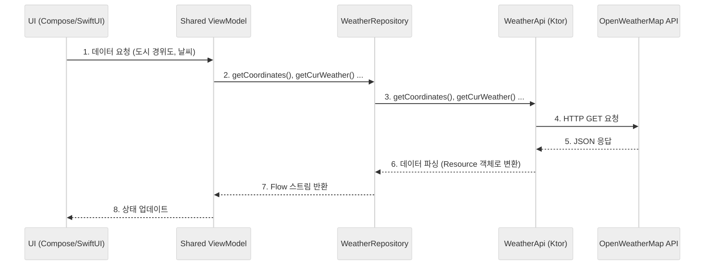
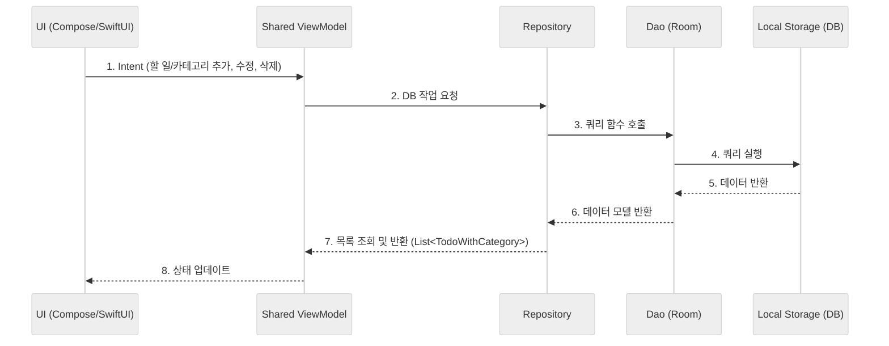

# KMP Weather & Todo App
`Kotlin Multiplatform(KMP)`을 사용하여 날씨 정보 조회 기능과 할 일(Todo) 관리 기능을 제공하는 애플리케이션. 공유 로직을 통해 개발 효율성과 코드 재사용성을 극대화하고, Android/iOS 양쪽 플랫폼에 일관된 비즈니스 로직을 제공한다.
</br></br></br>

## 요약
- **공유 로직**: 비즈니스 로직(ViewModel, Repository, API/DB)은 공통 코드로 작성

- **플랫폼별 UI**:
    - **Android**: `Jetpack Compose`
    - **iOS**: `SwiftUI`

## 주요 기능
- **날씨 정보 조회**
    - 도시 이름으로 날씨 검색
    - 현재 날씨, 시간별/일별 예보 제공

- **할 일 관리**
    - 할 일 추가, 수정, 삭제, 검색
    - 카테고리별 할 일 관리

## 적용 기술 및 아키텍처
- **Kotlin Multiplatform (KMP)**: `commonMain` 소스셋에 공유 비즈니스 로직 구현
    - **ViewModel**: UI 상태 관리
        - **Android**: `koinViewModel()` 를 통해 공유 모듈의 ViewModel 주입
        - **iOS**: `AndroidX ViewModel`을 직접 사용할 수 없어 iOS용 Wrapper ViewModel 클래스 구현
    - **Data Layer**: API 통신(`Ktor`), 로컬 데이터베이스(`Room`) 처리
    - **DI Modules**: 의존성 주입(`Koin`)

- **MVI (Model-View-Intent)**: `orbit-mvi` 라이브러리를 사용해 UI 상태를 단방향으로 관리

- **의존성 주입**: `Koin` 을 사용해 API, DB, Repository, ViewModel 등 역할별 모듈을 분리, 결합도 낮춤

## 프로젝트 구조
```
.
├── composeApp/  # 안드로이드 앱 (Jetpack Compose)
├── iosApp/      # iOS 앱 (SwiftUI)
└── shared/      # 공유 모듈
    └── src/
        ├── androidMain/ # 안드로이드 전용 코드
        ├── iosMain/     # iOS 전용 코드
        └── commonMain/  # 공통 코드
```

## 플랫폼별 구현
- **Android (`composeApp`)**
    - **UI 프레임워크**: `Jetpack Compose`
    - **구조**: 
        - `Single-Activity`
        - `NavHost`와 `TabRow`를 이용해 날씨와 할 일 화면 전환
    - **ViewModel 연동**: `koinViewModel()`로 공유 모듈의 ViewModel을 직접 주입

- **iOS (`iosApp`)**
    - **UI 프레임워크**: `SwiftUI`
    - **구조**: `Picker`를 이용해 날씨와 할 일 화면 전환
    - **ViewModel 연동**:
        - `AndroidX ViewModel`을 `SwiftUI`에서 직접 사용할 수 없어 별도의 Wrapper ViewModel 클래스 구현
        - `KMPNativeCoroutinesCombine` 라이브러리를 사용하여 `Kotlin`의 `StateFlow`를 `Swift`의 `Publisher`로 변환
        - 변환된 `Publisher` 구독 및 `@Published` 프로퍼티 업데이트를 통해 `SwiftUI` View가 자동으로 갱신되도록 연결

## 시퀀스 다이어그램
- **날씨 정보 조회**


- **할 일 관리**

